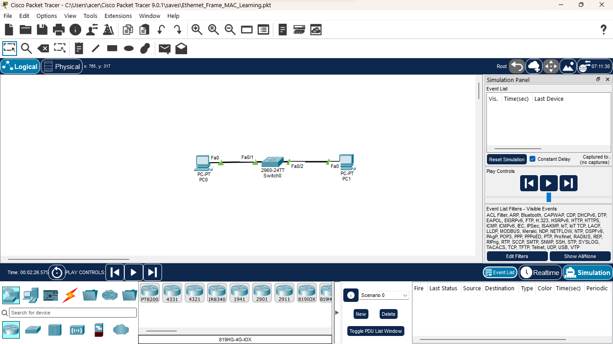
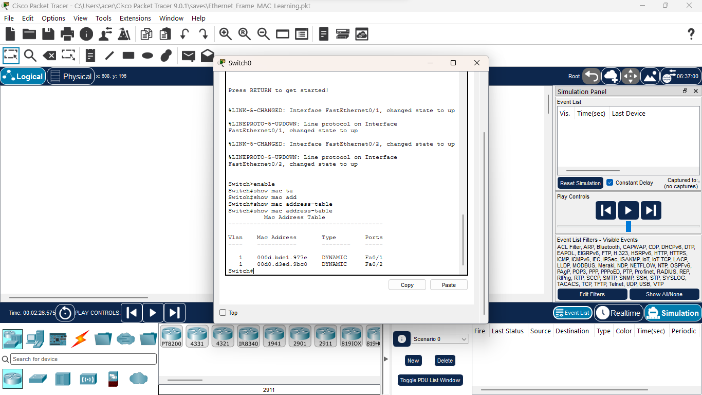
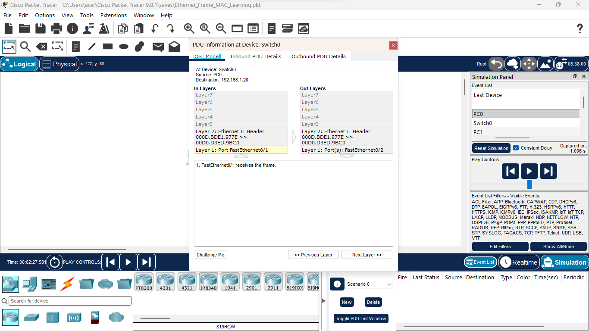
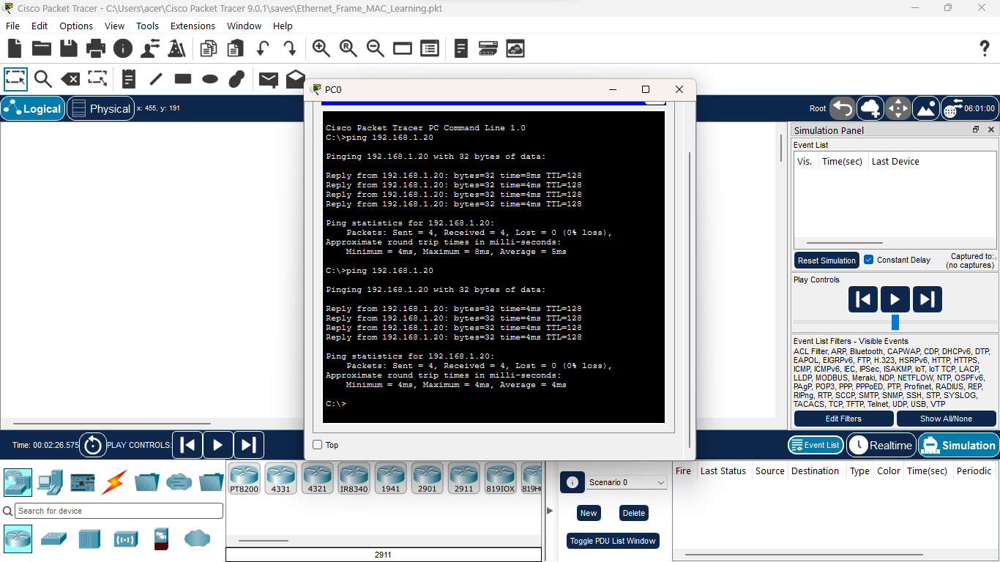
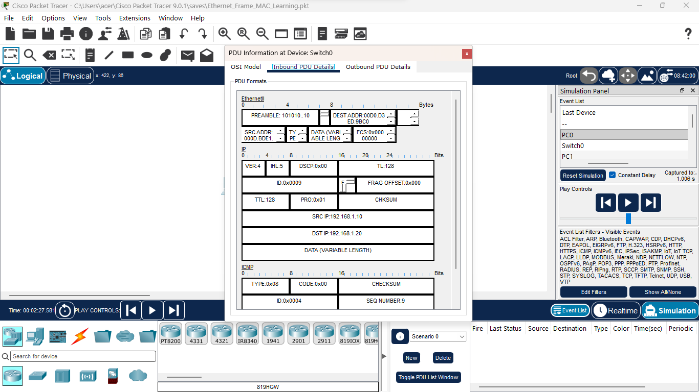
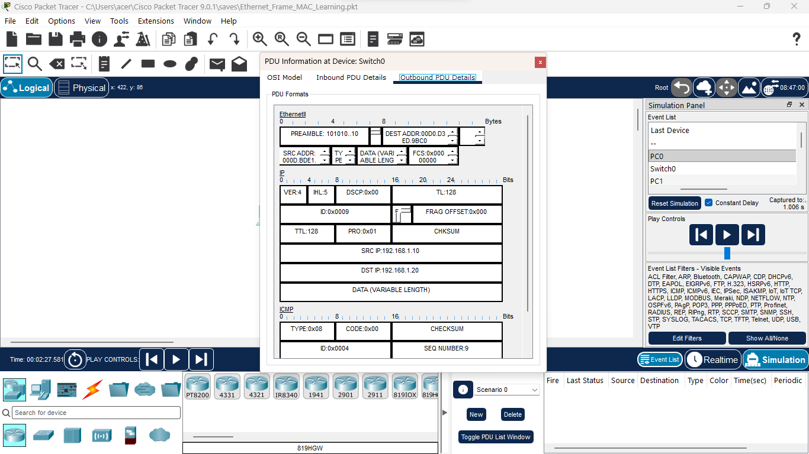
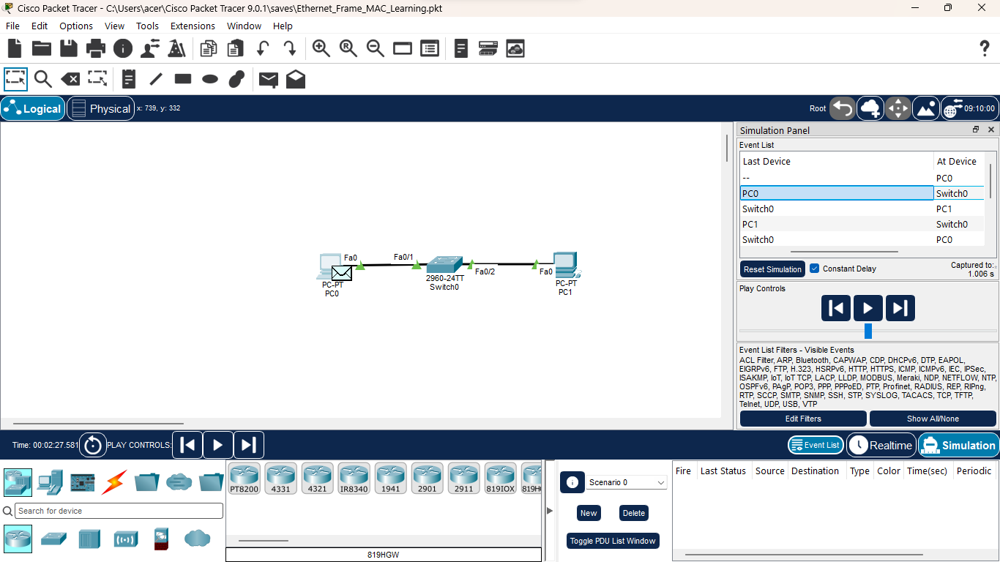

# Experiment 1 - Ethernet Frame & MAC Learning

## Objective

To understand Ethernet frame transmission, MAC address learning,
flooding, forwarding, and the operation of a Layer 2 switch.

## Topology

PC0 → Switch0 → PC1

## IP Addressing

| Device | IP Address | Subnet Mask |
|---|---|---|
| PC0 | 192.168.1.10 | 255.255.255.0 |
| PC1 | 192.168.1.20 | 255.255.255.0 |

## Concepts Observed

- Ethernet frames
- Source MAC address
- Destination MAC address
- MAC address learning
- MAC address table
- Flooding
- Forwarding
- Layer 2 switching
- ICMP ping
- Ethernet II frame structure

## Verification

The switch dynamically learned the MAC addresses of PC0 and PC1.

Ping connectivity between PC0 and PC1 was successful.

## Key Learning

A Layer 2 switch learns the source MAC address of an incoming frame
and associates it with the incoming switch port.

If the destination MAC address is unknown, the switch floods the frame
out the appropriate ports. Once the destination MAC is learned, the
switch forwards the frame only through the corresponding port.

## Tool

Cisco Packet Tracer

## Screenshots

### 1. Network Topology

### 2. MAC Address Table

### 3. PDU Analysis

### 4. Ping Verification

### 5. Inbound PDU

### 6. Outbound PDU

### 7. MAC Simulation

### Simulation Recording

[▶️ View Simulation Recording](./Lab-Simulation/mac-simulation.mp4)

## Simulation Observations

| Step | Observation |
|---|---|
| 1 | PC generates an ICMP Echo Request |
| 2 | Ethernet frame is created with source and destination MAC addresses |
| 3 | Switch learns the source MAC address |
| 4 | Unknown destination MAC causes flooding |
| 5 | Destination device receives the frame |
| 6 | Reply frame is forwarded using the learned MAC address |
