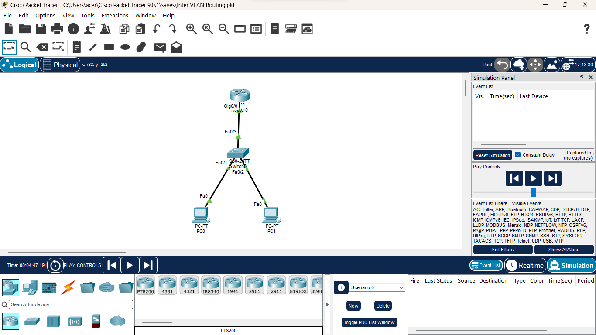
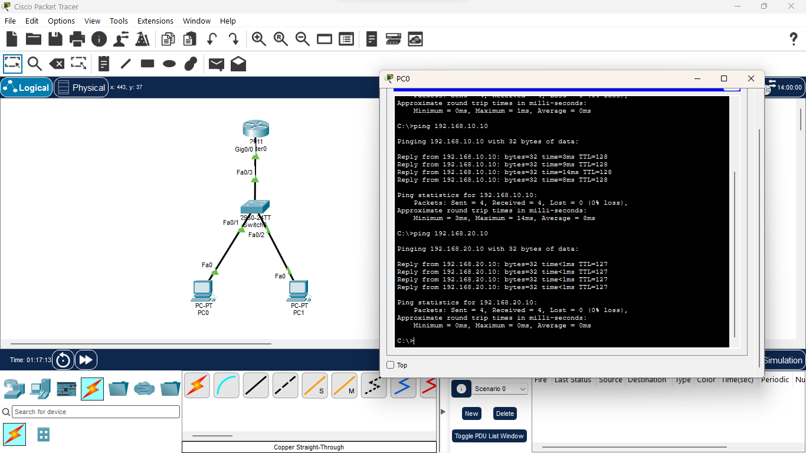

# Experiment 2 - Inter-VLAN Routing using Router-on-a-Stick

## Objective

To configure communication between different VLANs using
Router-on-a-Stick inter-VLAN routing.

## Topology

PC0 → Switch0 → Router0
PC1 → Switch0 → Router0

## VLAN Configuration

| VLAN | Name | Network |
|---|---|---|
| 10 | HR | 192.168.10.0/24 |
| 20 | IT | 192.168.20.0/24 |

## IP Addressing

| Device | IP Address | Subnet Mask | Default Gateway |
|---|---|---|---|
| PC0 | 192.168.10.10 | 255.255.255.0 | 192.168.10.1 |
| PC1 | 192.168.20.10 | 255.255.255.0 | 192.168.20.1 |

## Switch Configuration

- Fa0/1 configured as an access port in VLAN 10
- Fa0/2 configured as an access port in VLAN 20
- Fa0/3 configured as an 802.1Q trunk
- VLAN 10 named HR
- VLAN 20 named IT

## Router Configuration

Router-on-a-Stick was configured using router subinterfaces:

- G0/0.10 → VLAN 10 → 192.168.10.1/24
- G0/0.20 → VLAN 20 → 192.168.20.1/24

802.1Q encapsulation was configured on both subinterfaces.

## Verification

Inter-VLAN communication was verified using ICMP ping.

PC0 successfully communicated with PC1 across different VLANs.

## Concepts Learned

- VLANs
- Access ports
- Trunk ports
- 802.1Q
- Router subinterfaces
- Default gateways
- Inter-VLAN routing
- Layer 3 routing
- ICMP
- TTL

## Key Learning

Devices in different VLANs belong to different broadcast domains.
Communication between these VLANs requires a Layer 3 device.

In Router-on-a-Stick, a single physical router interface uses multiple
subinterfaces to provide gateways for multiple VLANs.

## Tool

Cisco Packet Tracer

## Screenshots

### Networking Topology

### Inter-VLAN Communication Verification

## Verification

Inter-VLAN communication was verified using ICMP ping.

PC0 (`192.168.10.10`) successfully pinged PC1 (`192.168.20.10`)
with 0% packet loss.

This confirms that traffic was successfully routed between VLAN 10
and VLAN 20 through the Router-on-a-Stick configuration.

## Simulation

The network was analyzed using Cisco Packet Tracer Simulation Mode
to observe the flow of traffic between VLAN 10 and VLAN 20.

### Simulation Video

[▶️ Watch the Inter-VLAN Routing Simulation](https://www.linkedin.com/posts/prakatheshwaran-arumugam-087946257_ccna-cisco-networking-activity-7507303507469750273-onXQ?utm_source=share&utm_medium=member_desktop&rcm=ACoAAD9SSOcBkPWZR0v80Cmqj_SbRRHKo4P_IbE)
